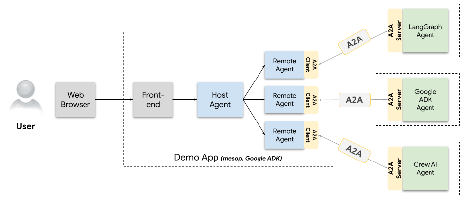

# Flight Recommendation System

A comprehensive travel planning system that combines **A2A (Agent-to-Agent)** communication with **MCP (Model Context Protocol)** to provide intelligent flight search, hotel recommendations, and itinerary generation services.



## 🎥 Demo Video

> **Note**: Add your demo video here when available
> 
> [](YOUR_VIDEO_URL_HERE)

## 🌟 Features

- **🛫 Flight Search Agent**: Powered by Google ADK (Agent Development Kit)
- **🏨 Hotel Search Agent**: Built with LangGraph for intelligent hotel recommendations
- **📋 Itinerary Generation Agent**: Uses CrewAI for comprehensive travel planning
- **🔄 Agent-to-Agent Communication**: Seamless multi-agent collaboration
- **🌐 Web Interface**: Modern UI for easy interaction
- **🔌 MCP Integration**: Model Context Protocol for enhanced agent communication

## 🏗️ Architecture

This project demonstrates the integration of multiple AI frameworks:

- **A2A (Agent-to-Agent)**: Enables seamless communication between different specialized agents
- **MCP (Model Context Protocol)**: Provides standardized communication protocol for AI agents
- **Multi-Agent System**: Three specialized agents working together to create comprehensive travel solutions

### Agent Overview

| Agent | Framework | Purpose |
|-------|-----------|---------|
| Flight Search | Google ADK | Find and compare flight options |
| Hotel Search | LangGraph | Discover and recommend hotels |
| Itinerary Generation | CrewAI | Create detailed travel itineraries |

## 🚀 Quick Start

### Prerequisites

- Python 3.11+
- uv (Python package manager)
- Required API keys (see Configuration section)

### Installation

1. **Clone the repository**
   ```bash
   git clone https://github.com/YOUR_USERNAME/Flight-Recommendation.git
   cd Flight-Recommendation
   ```

2. **Install dependencies**
   ```bash
   uv sync
   ```

3. **Set up environment variables**
   ```bash
   cp .env.example .env
   # Edit .env with your API keys
   ```

4. **Run the demo UI**
   ```bash
   cd demo/ui
   uv run python main.py
   ```

## 🔧 Configuration

Create a `.env` file in the project root with the following variables:

```env
# Google ADK Configuration (for Flight Search Agent)
GOOGLE_ADK_API_KEY=your_google_adk_api_key

# SerpAPI Configuration (for Hotel Search Agent)
SERP_API_KEY=your_serpapi_key

# Groq Configuration (for LangGraph)
GROQ_API_KEY=your_groq_api_key

# CrewAI Configuration (for Itinerary Agent)
OPENAI_API_KEY=your_openai_api_key

# MCP Server Configuration
MCP_SERVER_HOST=localhost
MCP_SERVER_PORT=8000
```

## 📁 Project Structure

```
Flight-Recommendation/
├── demo/                           # Demo application and UI
│   ├── ui/                        # Web interface
│   └── a2a_demo_arch.png         # Architecture diagram
├── mcp_server/                    # MCP server implementation
│   └── server.py                  # Main MCP server
├── samples/python/                # Agent implementations
│   ├── agents/
│   │   ├── flight_search_agent/   # Google ADK-based flight search
│   │   ├── hotel_search_agent/    # LangGraph-based hotel search
│   │   └── itinerary_generation_agent/ # CrewAI-based itinerary
│   ├── common/                    # Shared utilities and types
│   └── hosts/                     # Agent hosting infrastructure
└── README.md                      # This file
```

## 🎯 Usage Examples

### Flight Search
```python
from samples.python.agents.flight_search_agent import FlightSearchAgent

agent = FlightSearchAgent()
flights = agent.search_flights(
    origin="NYC",
    destination="LAX",
    departure_date="2024-06-15",
    return_date="2024-06-22"
)
```

### Hotel Search
```python
from samples.python.agents.hotel_search_agent import HotelSearchAgent

agent = HotelSearchAgent()
hotels = agent.search_hotels(
    location="Los Angeles",
    check_in_date="2024-06-15",
    check_out_date="2024-06-22"
)
```

### Itinerary Generation
```python
from samples.python.agents.itinerary_generation_agent import ItineraryAgent

agent = ItineraryAgent()
itinerary = agent.generate_itinerary(
    destination="Los Angeles",
    duration=7,
    interests=["beaches", "entertainment", "dining"]
)
```

## 🔗 Agent Communication

The system uses A2A communication to enable agents to work together:

1. **Flight Search Agent** finds available flights
2. **Hotel Search Agent** recommends accommodations based on flight details
3. **Itinerary Generation Agent** creates a comprehensive travel plan using both flight and hotel information

## 🛠️ Development

### Running Individual Agents

```bash
# Flight Search Agent
cd samples/python/agents/flight_search_agent
uv run python agent.py

# Hotel Search Agent
cd samples/python/agents/hotel_search_agent
uv run python agent.py

# Itinerary Generation Agent
cd samples/python/agents/itinerary_generation_agent
uv run python agent.py
```

### Running the MCP Server

```bash
cd mcp_server
uv run python server.py
```

### Testing

```bash
# Run all tests
uv run pytest

# Run specific test suite
uv run pytest demo/ui/tests/
```

## 📚 Documentation

- [Google ADK Documentation](https://developers.google.com/agent-developer-kit)
- [LangGraph Documentation](https://langchain-ai.github.io/langgraph/)
- [CrewAI Documentation](https://docs.crewai.com/)
- [MCP Protocol Specification](https://modelcontextprotocol.io/)

## 🤝 Contributing

1. Fork the repository
2. Create a feature branch (`git checkout -b feature/amazing-feature`)
3. Commit your changes (`git commit -m 'Add some amazing feature'`)
4. Push to the branch (`git push origin feature/amazing-feature`)
5. Open a Pull Request

## 📄 License

This project is licensed under the MIT License - see the [LICENSE](LICENSE) file for details.

## 🔮 Future Enhancements

- [ ] Real-time price monitoring
- [ ] Weather integration for travel planning
- [ ] Multi-language support
- [ ] Mobile application
- [ ] Advanced analytics and reporting
- [ ] Integration with more travel APIs

## 🙏 Acknowledgments

- Google ADK team for the flight search capabilities
- LangGraph community for the hotel search framework
- CrewAI developers for the itinerary generation tools
- MCP protocol contributors for standardized agent communication

## 📞 Support

If you encounter any issues or have questions:

1. Check the [Issues](https://github.com/YOUR_USERNAME/Flight-Recommendation/issues) page
2. Create a new issue with detailed information
3. Join our community discussions

---

**Made with ❤️ by [Your Name]**